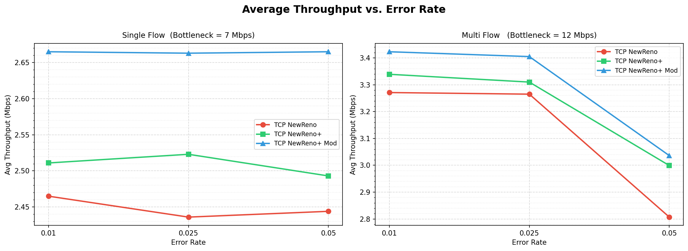
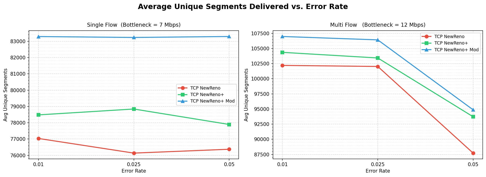
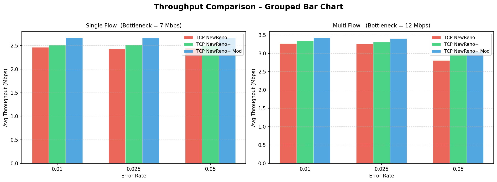
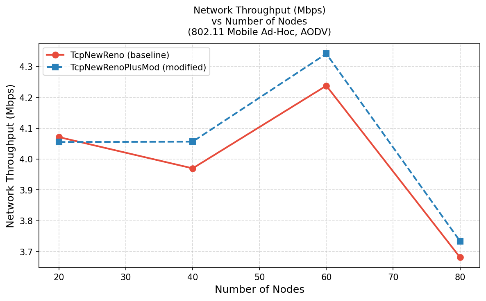
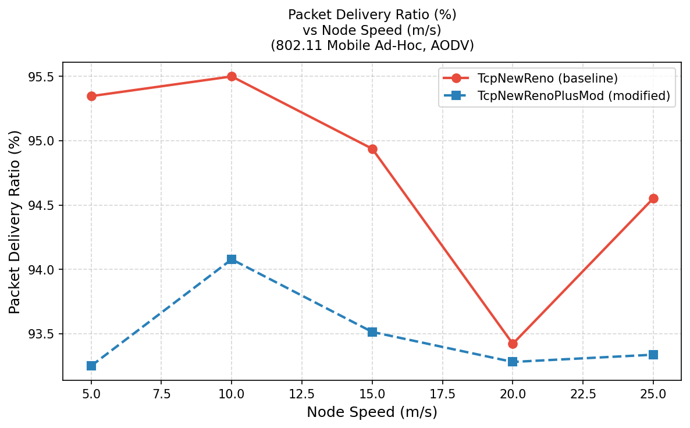
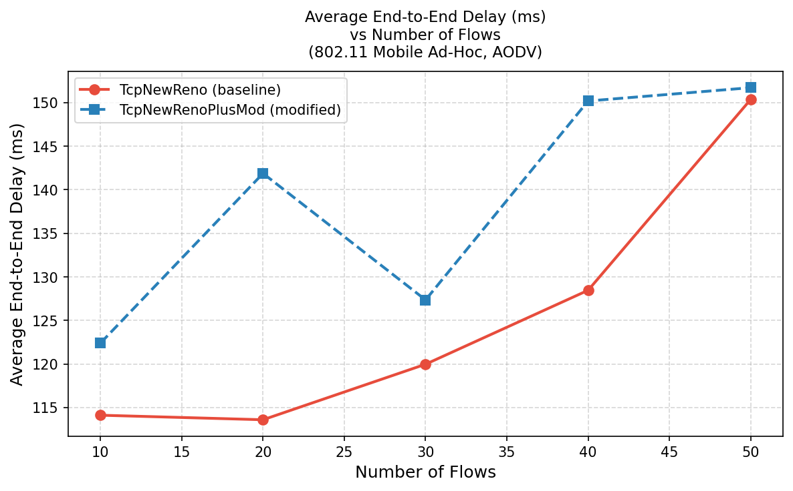
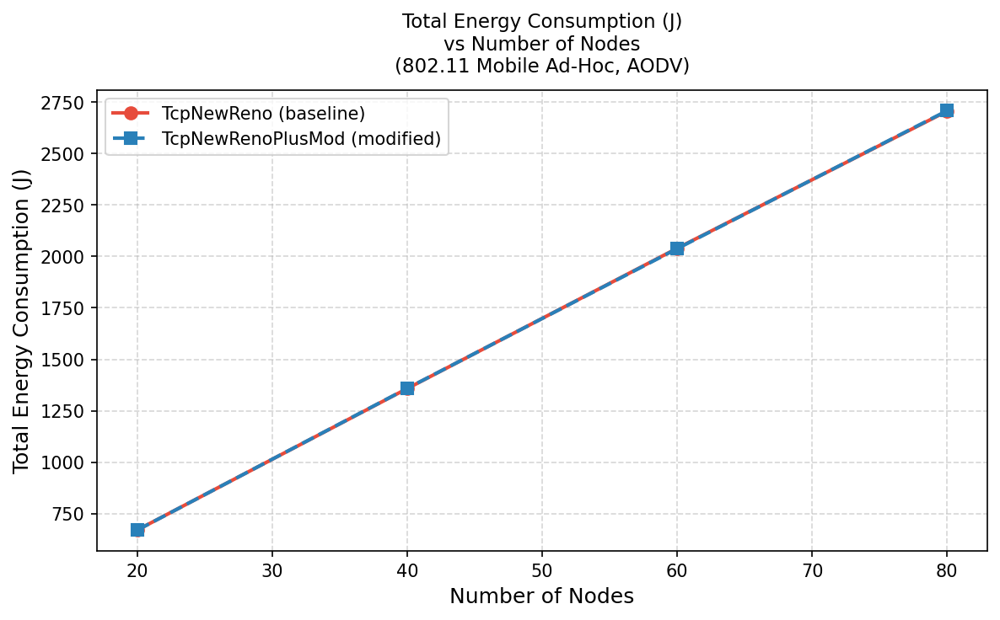
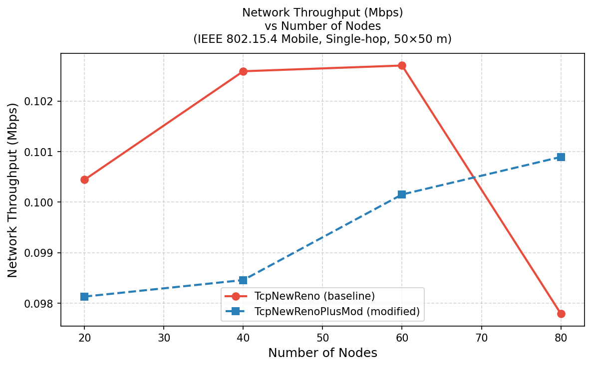
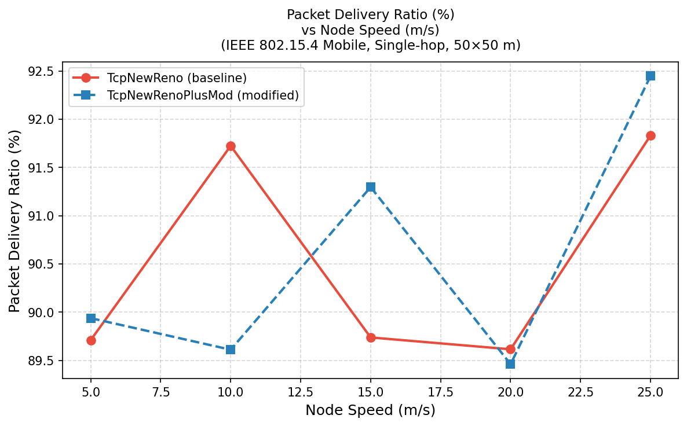

<h1 align="center">TCP NewReno+ · NS-3 Implementation &amp; Evaluation</h1>

<p align="center">
  <a href="https://www.nsnam.org/"></a>
  <a href="LICENSE"></a>
  
  
  
</p>

<p align="center">
  <em>A faithful NS-3 reimplementation and extended evaluation of the IEEE paper<br>
  <strong>"Modified TCP NewReno for Wireless Networks"</strong><br>
  Kabir, Das et al. · IEEE 2015</em>
</p>

---

## 📌 Abstract

TCP's congestion control was designed for wired networks where packet loss equals congestion. In wireless networks, **random bit errors** are the dominant loss cause — not congestion. Throttling the transmission rate in response to a bit-error loss is therefore counterproductive and severely degrades throughput.

**TCP NewReno+** addresses this by tracking statistical counters (timeout count `TC`, duplicate-ACK count `DC`, and inter-timeout intervals) to distinguish congestion events from wireless bit-error events. When bit errors are detected, the algorithm reduces the congestion window **less aggressively**, preserving throughput.

This project:
1. **Reimplements** the original ns-2 algorithm in modern **C++ / NS-3 v3.45**
2. **Extends** it with a further-modified variant (`TcpNewRenoPlusMod`) with refined threshold logic
3. **Evaluates** all three variants across three distinct network environments

---

## 🏗️ Network Topology (Paper-Faithful)

```
  [Wired Node 0] ──5Mbps──┐
  [Wired Node 1] ──5Mbps──┤            ╔══════════════╗
  [Wired Node 2] ──5Mbps──┤            ║  802.11g AP  ║──── [STA 0]  ← TCP Sink 1
                           ├──[Head]───║  (Gateway)   ║──── [STA 1]  ← TCP Sink 2
                           │  7/12Mbps ║              ║──── [STA 2]  ← UDP Sink
                           │ bottleneck╚══════════════╝──── [STA 3]  → UDP Src
                           │                                [STA 4]  ← UDP Sink 2
  ▲ All wired nodes: 5 Mbps dedicated link to Head Node
  ▲ Bottleneck: 7 Mbps (single-flow) or 12 Mbps (multi-flow)
  ▲ Wireless error model: RateErrorModel on STA PHY layer
```

| Connection | Type | Direction |
|-----------|------|-----------|
| Flow 1 | TCP (BulkSend) | Wired[0] → STA[0] |
| Flow 2 | TCP (BulkSend) | Wired[1] → STA[1] *(multi only)* |
| UDP CBR 1 | Background traffic | Wired[2] → STA[2] |
| UDP CBR 2 | Wireless-to-wireless | STA[3] → STA[4] |

---

## 📊 Key Results

### Single-Flow Scenario (Bottleneck = 7 Mbps)

| Error Rate | TCP NewReno | TCP NewReno+ | TCP NewReno+ *Mod* | Best |
|-----------|-------------|--------------|---------------------|------|
| 1% | 77,036 segs · 2.465 Mbps | 78,482 segs · 2.511 Mbps | **83,286 segs · 2.665 Mbps** | **+8.1%** |
| 2.5% | 76,139 segs · 2.436 Mbps | 78,842 segs · 2.523 Mbps | **83,230 segs · 2.663 Mbps** | **+9.3%** |
| 5% | 76,375 segs · 2.444 Mbps | 77,895 segs · 2.493 Mbps | **83,289 segs · 2.665 Mbps** | **+9.1%** |
| 10% | 20,861 segs · 0.668 Mbps | 45,610 segs · 1.460 Mbps | 18,841 segs · 0.603 Mbps | **NewReno+** |

### Multi-Flow Scenario (Bottleneck = 12 Mbps)

| Error Rate | TCP NewReno | TCP NewReno+ | TCP NewReno+ *Mod* | Best |
|-----------|-------------|--------------|---------------------|------|
| 1% | 102,204 segs · 3.271 Mbps | 104,356 segs · 3.339 Mbps | **106,974 segs · 3.423 Mbps** | **+4.7%** |
| 2.5% | 102,024 segs · 3.265 Mbps | 103,428 segs · 3.310 Mbps | **106,417 segs · 3.405 Mbps** | **+4.3%** |
| 5% | 87,722 segs · 2.807 Mbps | 93,724 segs · 2.999 Mbps | **94,869 segs · 3.036 Mbps** | **+8.1%** |
| 10% | 7,597 segs · 0.243 Mbps | 6,623 segs · 0.212 Mbps | **12,912 segs · 0.413 Mbps** | **+70%** |

> **Metric**: Average unique TCP segments received at the sink — same metric as the original paper (Table 2 & Table 3).

---

## 📈 Result Plots

### TCP NewReno vs NewReno+ vs NewReno+Mod

| Throughput Comparison | Unique Segments Delivered |
|---|---|
|  |  |

| Grouped Bar Chart |
|---|
|  |

### WiFi Mobile Ad-Hoc (802.11b MANET) — Parameter Sweeps

| Throughput vs. Nodes | PDR vs. Speed |
|---|---|
|  |  |

| Delay vs. Flows | Energy vs. Nodes |
|---|---|
|  |  |

### WPAN / IoT (802.15.4 · 6LoWPAN) — Parameter Sweeps

| Throughput vs. Nodes | PDR vs. Speed |
|---|---|
|  |  |

---

## ⚙️ Algorithm Description

### Parameters

| Symbol | Meaning |
|--------|---------|
| `TC` | Running count of timeout events |
| `DC` | Running count of 3-dupack events |
| `TDR` | Smoothed ratio TC/DC |
| `TDRT` | Threshold for TDR |
| `TDRA` | Aging (smoothing) factor for TDR |
| `ITR` | Smoothed ratio TI/TD (timeout interval / inter-timeout gap) |
| `ITRT` | Threshold for ITR |
| `ITRA` | Aging factor for ITR |

### DUPACKACTION — on 3 duplicate ACKs
```
DC = DC + 1
TDR = TDRA * TDR  +  (1 - TDRA) * (TC / DC)
TD  = CurrentTime - LatestTimeout
ITR = ITRA * ITR  +  (1 - ITRA) * (TI / TD)
Reset retransmission timer
Fast-retransmit the presumed lost segment
CALL SLOWDOWNACTION(DUPACK)
```

### TIMEOUTACTION — on RTO expiry
```
TC = TC + 1
TDR = TDRA * TDR  +  (1 - TDRA) * (TC / DC)
DC  = MAX(DC / 4, 1)             ← decay DC on true timeout
PreviousTimeout = LatestTimeout
LatestTimeout   = CurrentTime
TD  = LatestTimeout - PreviousTimeout
ITR = ITRA * ITR  +  (1 - ITRA) * (TI / TD)
Reset retransmission timer
CALL SLOWDOWNACTION(TIMEOUT)
Retransmit segment
```

### SLOWDOWNACTION — the core innovation
```
# Standard NewReno values (always computed)
IF Event = DUPACK:
    NRssthresh = cwnd / 2 ;  NRcwnd = NRssthresh + 3
IF Event = TIMEOUT:
    NRssthresh = cwnd / 2 ;  NRcwnd = 1

# NewReno+ override: use less-aggressive window if bit-error detected
IF TDR < TDRT  AND  ITR < ITRT:          # strong bit-error signal
    Kssthresh = 3/4 * cwnd
    Kcwnd     = 1/2 * cwnd
ELIF TDR < TDRT  OR  ITR < ITRT:         # weak bit-error signal
    Kssthresh = 2/3 * cwnd
    Kcwnd     = NRcwnd
ELSE:                                     # congestion — use standard
    Kssthresh = NRssthresh
    Kcwnd     = NRcwnd

ssthresh = MAX(Kssthresh, NRssthresh)
cwnd     = MAX(Kcwnd,     NRcwnd)
```

---

## 📁 Repository Structure

```
TCP-NewRenoPlus-Improved-NS3/
│
├── scratch/                          # NS-3 simulation programs (C++)
│   ├── newreno-plus-test.cc          # ★ Main: wired-wireless hybrid topology
│   ├── wifi-mobile-sim.cc            # 802.11b MANET with energy model
│   └── wpan-mobile-sim.cc            # 802.15.4 / 6LoWPAN IoT simulation
│
├── plots/                            # Generated result figures (PNG)
│   ├── newReno_vs_newRenoPlus/       # 2-variant comparison charts
│   ├── newReno_vs_newRenoPlus_newrenoplusmod/  # 3-variant comparison charts
│   ├── wifi/                         # 20 WiFi parameter-sweep plots
│   └── wpan/                         # 20 WPAN parameter-sweep plots
│
├── plot_results.py                   # Plot: 3-variant wired/wireless comparison
├── plot_wifi.py                      # Plot: WiFi sweep (5 metrics × 4 params)
├── plot_wpan.py                      # Plot: WPAN sweep (5 metrics × 4 params)
├── plot_reno_comparison.py           # Plot: 2-variant comparison
│
├── run_error_sweep.sh                # Sweep error rates for paper topology
├── run_modified_sweep.sh             # Sweep for TcpNewRenoPlusMod variant
├── run_comparison.sh                 # Run 2-variant comparison
├── run_wifi_sweep.sh                 # Sweep all WiFi parameters
├── run_wpan_sweep.sh                 # Sweep all WPAN parameters
│
├── Final_simulation_results.csv     # ★ Main result data (3 variants × 4 error rates)
├── wifi_mobile_results.csv           # WiFi MANET sweep results
├── wpan_mobile_results.csv           # WPAN sweep results
│
├── report.pdf                        # Full LaTeX simulation report
├── paper.pdf                         # Original IEEE reference paper
├── RUN.md                            # Step-by-step build & run guide
└── SUMMARY.md                        # Project summary
```

---

## 🚀 Quick Start

### Prerequisites
```bash
# Ubuntu / Debian
sudo apt install g++ cmake python3 python3-pip git
pip3 install matplotlib pandas numpy

# NS-3 dependencies
sudo apt install libsqlite3-dev libgsl-dev libgtk-3-dev
```

### 1. Build NS-3
```bash
cd ns-3.45/
./ns3 configure --enable-examples --enable-tests
./ns3 build
```

### 2. Run the main simulation (single command)
```bash
# TcpNewRenoPlusMod at 1% error, multi-flow scenario
./ns3 run "newreno-plus-test \
    --tcpVariant=TcpNewRenoPlusMod \
    --errorRate=0.01 \
    --scenario=multi \
    --simulationTime=250 \
    --outputFile=my_results.csv"
```

### 3. Reproduce all paper results
```bash
bash run_error_sweep.sh        # Runs all 3 variants × 4 error rates × 2 scenarios
bash run_modified_sweep.sh     # Extended sweep for TcpNewRenoPlusMod
```

### 4. Generate all plots
```bash
python3 plot_results.py        # 3-variant wired/wireless comparison
python3 plot_wifi.py           # 20 WiFi parameter-sweep charts
python3 plot_wpan.py           # 20 WPAN parameter-sweep charts
```

> See [RUN.md](RUN.md) for the complete step-by-step guide.

---

## 🔬 Three Simulation Scenarios

| Scenario | File | Network | Key Parameters |
|---------|------|---------|----------------|
| **Wired-Wireless Hybrid** | `newreno-plus-test.cc` | 3 wired + 5 WiFi STAs | Error rate 1–10%, 250s simulation |
| **WiFi MANET** | `wifi-mobile-sim.cc` | 20–80 mobile nodes, 802.11b ad-hoc | OLSR/AODV routing, speed 5–25 m/s |
| **WPAN / IoT** | `wpan-mobile-sim.cc` | 40 nodes, 802.15.4 + 6LoWPAN + IPv6 | Tiny segments (80 B), single-hop PAN |

---

## 📖 Reference

> Md. Humayun Kabir and Rajkumar Das, *"Modified TCP NewReno for Wireless Networks"*, Department of Computer Science and Engineering, Bangladesh University of Engineering and Technology (BUET), IEEE 2015.

Original algorithm proposed and validated in **ns-2**. This project reimplements and extends it in **NS-3 v3.45** with:
- 802.11g (infrastructure) instead of ns-2's wireless model
- A further-modified variant (`TcpNewRenoPlusMod`) with improved cwnd/ssthresh logic
- Extended evaluation across WiFi MANET and IoT/WPAN networks

---

## 📝 License

This project is released under the [GNU General Public License v2.0](LICENSE), consistent with the NS-3 framework license.
